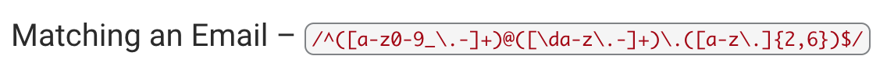

# Title
Rejecting writing norms with Rejex

## Summary

Briefly summarize the regex you will be describing and what you will explain. Include a code snippet of the regex. Replace this text with your summary.

This gist will cover regex over email addresses. It will show how to decipher an email and validate your email address. 

## Table of Contents

- [Anchors](#anchors)
- [Quantifiers](#quantifiers)
- [OR Operator](#or-operator)
- [Character Classes](#character-classes)
- [Flags](#flags)
- [Grouping and Capturing](#grouping-and-capturing)
- [Bracket Expressions](#bracket-expressions)
- [Greedy and Lazy Match](#greedy-and-lazy-match)
- [Boundaries](#boundaries)
- [Back-references](#back-references)
- [Look-ahead and Look-behind](#look-ahead-and-look-behind)

## Regex Components

### Anchors
^ Matches the beginning of the regex expression.
$ Matches the end of the regex expression.

### Quantifiers
a* Matches 0 or more of the preceding variable.
a+ Matches 1 or more of the preceding variable.
a? Matches 0  or 1 of the preceding variable.
a{#} Matches the exact amount of the inserted number in the curly brackets.
a{#} Matches the exact amount of the inserted number in the curly brackets or more.
a{#1,#2} Matches between inserted number 1 and inserted number 2.

### OR Operator
ab | cd Matches between ab or cd.

### Character Classes
. any chacter except a newline.  
\w Matches any word characters.  
\W Matches anything except a word character.  
\d Matches any numerical characters  
\D Matches anything except a numerical character.  
\s Matches any white space.  
\S Matches anything except a white space. 

### Flags
i (ignore Case) Makes the whole expression case insensitive
g (global) Indicates that the regular expression should be tested against all possible matches in a string.
m (multiline) The start and end anchors will match the start and end of a new line instead of a string.
u (unicode) Allows you to use extended unicode escapes.
y (sticky) Will only match from lastIndex and ignore the global variable.
s (dotall) Will match any character even new line.

### Grouping and Capturing
(abc) Creates a capture group that matches any characters that have the variables inside the parentheses.

### Bracket Expressions
[abc] Matches any character that is in between the brackets.
[^abc] Matches any character that is not in between the brackets.
[a-z] Matches any letters that is are in between the letters a and z.
[123] Matches any character that is in between the brackets.
[^123] Matches any character that is not in between the brackets.
[0-1] Matches any numbers that is are in between the numbers 0 and 0.

### Greedy and Lazy Match
* + {} These are greedy operators. They will expand the search as far as the text is provided.
? This is a lazy operator. Causes the search to match as few as possible.

### Boundaries
\b Matches where this is a word boundary. Word boundary is where one side is a word character and the other side is not. 
\B Matches where there is not a word boundary.

### Back-references
\# references whatever inserted number capture group you have.

### Look-ahead and Look-behind
(?:abc) Groups multiple characters without creating a capture group.
(?=abc) Groups multiple characters without including it in the result.
(?!abc) Can not match after the main expression otherwise it is discarded.

## Author
This regex expression was made by Luis Garcia
You can follow more of my work at the following GitHub account.
GitHub: https://github.com/garcia2697